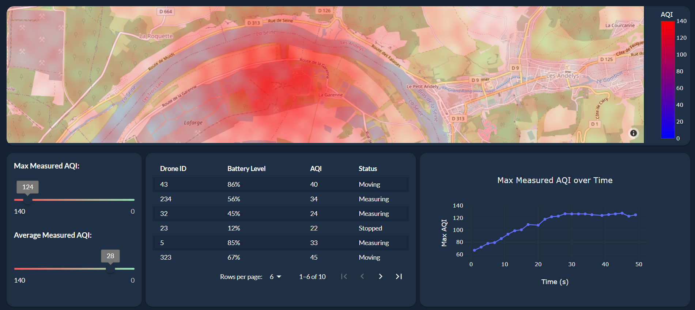

F2023-022 Fatima tul Zahra
F2023-013 Zainab Naeem 
F2023-091 M Rafay Hussain

# Realtime Pollution Dashboard


A use-case of measuring air quality with sensors around a factory to showcase the ability of Taipy to dashboard streaming data.

<p align="center">
  
</p>

## How to use

1. Clone this repository

```bash
git clone https://github.com/Avaiga/demo-realtime-pollution.git
```

2. Install requirements

```bash
pip install -r requirements.txt
```

3. Go to the `src` directory

```
cd src
```

4. Run the receiver script

```bash
python receiver.py
```

This should open a dashboard in your browser.

5. Run the sender script

```bash
python sender.py
```

This will send data to the dashboard.
